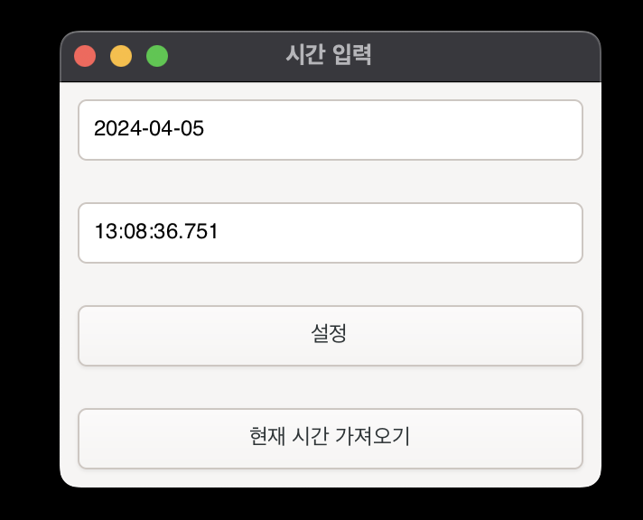

# 위버스 공방/사녹/폼림 클릭 GUI 매크로

이 프로그램은 사용자가 지정한 시간에 자동으로 마우스 좌클릭을 수행합니다.

꼭 위버스 폼림이 아니더라도 타이밍에 맞추어 클릭해야 하는 다른 모든 플랫폼에서도 사용할 수 있습니다.

> [!CAUTION]
> 실전에서 사용하기 전에 꼭 자신의 컴퓨터에서 클릭이 작동하는지 확인하고 그다음 사용해 주세요.
> enigo 라이브러리 이슈로 리눅스 Wayland 환경에서는 작동 안할 수도 있습니다.

## 빌드 환경 구축 방법

각 운영 체제별로 필요한 라이브러리와 도구를 설치하는 방법입니다.

### Linux

```bash
sudo apt install libxdo-dev libgtk-4-dev build-essential
```

### macOS

```bash
brew install gtk4
```

### Windows

Windows 사용자는 [GTK4 공식 문서](https://gtk-rs.org/gtk4-rs/stable/latest/book/installation_windows.html)를 참조하여 필요한 구성 요소를 설치해주세요.

## 프로그램 빌드 방법

아래의 명령어를 사용하여 프로그램을 빌드합니다. 이 과정을 통해 `target/release` 폴더에 실행 파일이 생성됩니다.

```bash
cargo build --release
```

## 사용 방법



1. 위의 지시사항에 따라 빌드 환경을 준비합니다.
2. 프로그램을 빌드합니다.
3. 실행 파일을 사용하여 원하는 시간에 자동 클릭을 설정합니다.

## FAQ

- Q. 실제로 작동하나요?
- A. 사실 운이 관여하는 부분이 크긴하지만, 저는 개인적으로 사용하면서 나쁘지 않은 승률로 공방에 여러번 간 기억이 있습니다.

- Q. 그외 더 팁이 있나요?
- A. 서버 부하로 연결이 밀릴것에 대비해 컴퓨터 2대 이상으로 동시에 사용하시는걸 추천드립니다.(2컴을 사용하든 지인에게 부탁해서 같이 동시에 사용하는 방식으로 하든 하시면 됩니다.)
